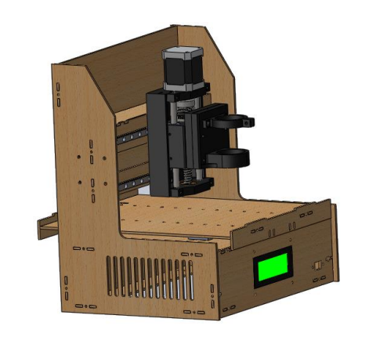

# Driller

#### Proyecto Final Grupal - Tecnicatura en Mecatrónica - Camada 2018

Este proyecto fue realizado por toda la camada 2018 del estudio terciario _Mecatrónica_ brindado por  la _Cámara de Comercio e Industria Argentino-Alemana **(AHK)**_ en formato de Sistema Dual Alemán.

Consiste en una _Agujereadora Automática de Plaquetas Electrónicas_,  para acelerar y optimizar el tiempo del proceso de producción de plaquetas

La parte teórica, en donde fue hecho este proyecto, se cursó en el _Centro de Formación Industrial_ del _Instituto Hölters Schule_ mientras que cada alumno realizó la parte práctica del terciario en una empresa capacitadora

Más información sobre la **Tecnicatura en Mecatrónica** en [la página de la AHK](https://www.ahkargentina.com.ar/formaciones/sistema-dual-aleman/tecnicatura-en-mecatronica)
